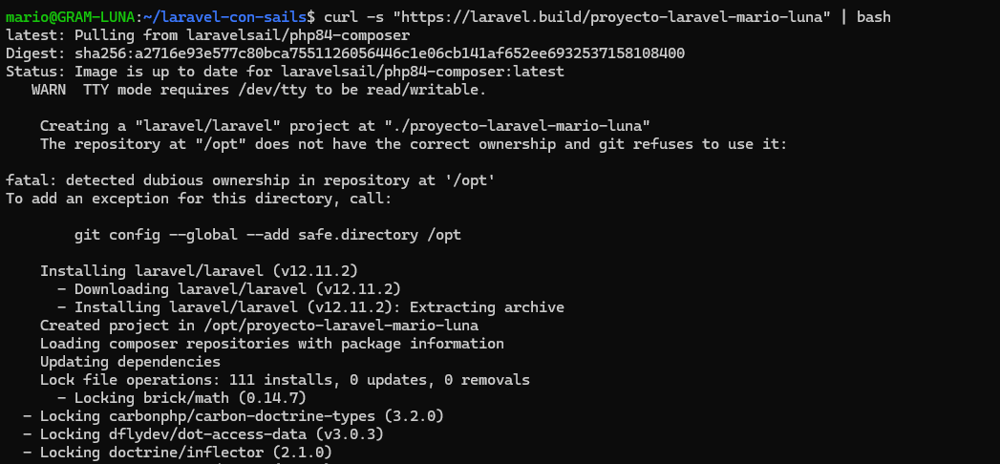
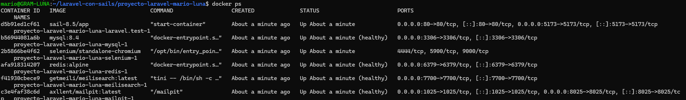
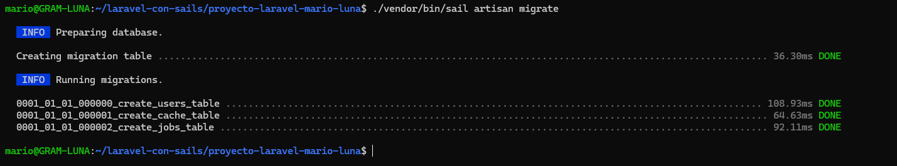
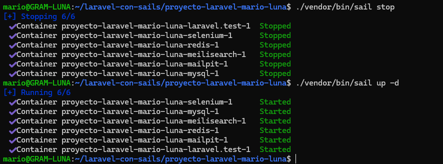

# Práctica: Entorno de desarrollo Laravel con Sails

> Mario Luna López 2ºDAW_B

**Repositorio:** *[github.com/mlunlop-iezv/laravel-con-sails](https://github.com/mlunlop-iezv/laravel-con-sails)*

---

## 1. Requisitos Previos

Antes de empezar con el despliegue tenemos que tener instaladas y configuradas estas cosas en nuestro sistema operativo:

* **Docker Desktop:** Tiene que estar instalado y corriendo para poder gestionar los contenedores.
* **WSL 2:** Necesario si estamos trabajando en Windows.
* **Terminal o consola de comandos:** Para poder lanzar los comandos.

---

## 2. Creación del Scaffolding del Proyecto

Lo primero es crear la estructura base del proyecto. Lo bueno de hacerlo así es que no hace falta instalar PHP ni Composer en nuestro ordenador. En su lugar, usamos un contenedor temporal de Docker que hace el trabajo sucio por nosotros.

1. Abrimos la terminal y vamos a la carpeta donde queremos guardar el proyecto.
2. Lanzamos el instalador oficial de Laravel pasándole el nombre de nuestro proyecto (en este caso, `proyecto-laravel-mario-luna`):

```bash
curl -s "https://laravel.build/proyecto-laravel-mario-luna" | bash
```



---
## 3. Configuración y Arranque con Laravel Sail

Ahora que ya se ha descargado la estructura del proyecto, vamos a usar **Laravel Sail**, que es una herramienta de línea de comandos para manejar el entorno Docker de Laravel.

### 3.1. Inicio de los Contenedores

Para levantar el entorno, entramos en la carpeta del proyecto y ejecutamos el comando de inicio. Usamos -d para que los contenedores se queden en segundo plano y no nos bloqueen la terminal.

```bash
cd proyecto-laravel-mario-luna
./vendor/bin/sail up -d
```

### 3.2. Verificación de Servicios

Laravel Sail nos configura automáticamente todo lo necesario para una app moderna:

* PHP 8.x

* Nginx (Servidor Web)

* MySQL (Base de datos)

* Redis (Caché)

Para comprobar que todo se ha levantado bien y se comunican entre ellos, listamos los contenedores activos:

```bash
docker ps
```



## 4. Ejecución de Migraciones y Pruebas

Con los contenedores activos, el siguiente paso es preparar la base de datos y ver si la web funciona desde el navegador.

### 4.1. Migración de Base de Datos

Aunque el contenedor de MySQL funciona, la base de datos está vacía. Para crear las tablas que necesita el framework, lanzamos las migraciones a través de Sail:

```bash
./vendor/bin/sail artisan migrate
```

Este comando conecta la aplicación con la base de datos y nos crea las tablas.



### 4.2. Acceso a la Aplicación

Por último, comprobamos que la aplicación es accesible. Laravel Sail expone la app en el puerto 8000 de nuestra máquina.

Abrimos un navegador y entramos en: `http://localhost`.

Si todo ha ido bien, veremos la página de bienvenida de Laravel con las versiones de PHP instaladas.


## 5. Comandos Útiles de Mantenimiento

Para el día a día (parar los contenedores cuando terminemos o arrancarlos de nuevo), usaremos los comandos propios de Sail.

Aquí resumo los más comunes:

| Acción | Comando |
| :--- | :--- |
| **Detener contenedores** | `./vendor/bin/sail stop` |
| **Arrancar contenedores** | `./vendor/bin/sail up -d` |
| **Instalar dependencias** | `./vendor/bin/sail composer install` |
| **Ejecutar tests** | `./vendor/bin/sail test` |



## 6. Configuración con Podman

Si en vez de Docker Desktop usamos **Podman**, hay que hacer unos ajustes extra para que no den fallos los volúmenes ni los puertos.

### 6.1. Activación del Socket

Podman necesita tener activo su servicio de socket a nivel de usuario para que Sail pueda interactuar con él.

```bash
systemctl --user enable --now podman.socket
```

### 6.2. Ajuste de Puertos

Es normal cambiar el puerto por defecto para evitar conflictos. Para ello, editamos el fichero .env del proyecto y definimos la variable APP_PORT.

```ini
APP_PORT=8080
```

### 6.3. Permisos de Usuario (User ID)

Para evitar problemas de permisos al escribir en los volúmenes, tenemos que poner nuestro usuario local en el contenedor.

Sacamos nuestros identificadores de usuario y grupo:

```bash
id -u
id -g
```

Añadimos o modificamos las siguientes variables en el archivo .env:

```ini
WWWUSER=1000
WWWGROUP=1000
```